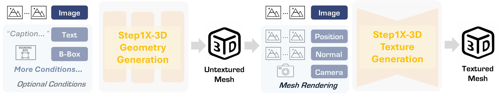

<p align="left">
        <a href="README_CN.md">中文</a> &nbsp｜ &nbsp English&nbsp&nbsp 
</p>


<h1 align="center"> Step1X-3D: Towards High-Fidelity and Controllable<br>Generation of Textured 3D Assets</h1>

<div align="center">
  <a href=https://huggingface.co/spaces/stepfun-ai/Step1X-3D  target="_blank"></a>
  <a href=https://huggingface.co/stepfun-ai/Step1X-3D target="_blank"></a>
  <a href=https://arxiv.org/abs/2505.07747 target="_blank"></a>
  <a href=https://stepfun-ai.github.io/Step1X-3D/ target="_blank"></a>
</div>

<p align="center">
  
</p>

<div align="center">
  
</div>

<div align="left">
<p><b>Step1X-3D demonstrates the capability to generate 3D assets with high-fidelity geometry and versatile texture maps, while maintaining exceptional alignment between surface geometry and texture mapping. From left to right, we sequentially present: the base geometry (untextured), followed by cartoon-style, sketch-style, and photorealistic 3D asset generation results.</b></p>
</div>

## 🔥🔥🔥 Latest News!!
* May 13, 2025: 👋 Step1X-3D online demo is available on huggingface-enjoy yourself with generated 3D assets! [Huggingface web live](https://huggingface.co/spaces/stepfun-ai/Step1X-3D)
* May 13, 2025: 👋 We release the 800K uids of high quality 3D assets (excluding self-collected assets) obtained with our rigorous data curation pipeline for both training 3D geometry and synthesis. [Huggingface dataset](https://huggingface.co/datasets/stepfun-ai/Step1X-3D-obj-data/tree/main)
* May 13, 2025: 👋 We have also released the training code of both Step1X-3D geometry generation and texture synthesis. 
* May 13, 2025: 👋 We have released the inference code and model weights of Step1X-3D geometry and Step1X-3D texture.
* May 13, 2025: 👋 We have released Step1X-3D [technical report](https://arxiv.org/abs/2505.07747) as open source.

<!-- ## Image Edit Demos -->


## 📑 Open-source Plan
- [x] Technical report
- [x] Inference code & model weights
- [x] Training code
- [x] Uid of high quality 3D assets
- [x] Online demo (gradio deployed on huggingface)
- [ ] More controllable models, like conditioned with multi-view, bounding-box and skeleton
- [ ] ComfyUI

## 1. Introduction
While generative artificial intelligence has advanced significantly across text, image, audio, and video domains, 3D generation remains comparatively underdeveloped due to fundamental challenges such as data scarcity, algorithmic limitations, and ecosystem fragmentation. 
To this end, we present Step1X-3D, an open framework addressing these challenges through: 
(1) a rigorous data curation pipeline processing >5M assets to create a 2M high-quality dataset with standardized geometric and textural properties; 
(2) a two-stage 3D-native architecture combining a hybrid VAE-DiT geometry generator 
with an SD-XL-based texture synthesis module; and (3) the full open-source release of models, training code, and adaptation modules. For geometry generation, the hybrid VAE-DiT component produces watertight TSDF representations by employing perceiver-based latent encoding with sharp edge sampling for detail preservation. The SD-XL-based texture synthesis module then ensures cross-view consistency through geometric conditioning and latent-space synchronization.
Benchmark results demonstrate state-of-the-art performance that exceeds existing open-source methods, while also achieving competitive quality with proprietary solutions. 
Notebly, the framework uniquely bridges 2D and 3D generation paradigms by supporting direct transfer of 2D control techniques(e.g., LoRA) to 3D synthesis.
By simultaneously advancing data quality, algorithmic fidelity, and reproducibility, Step1X-3D aims to establish new standards for open research in controllable 3D asset generation.


## 2. Models Downloading
| Model                       | Download link                   | Size       | Update date |                                                                                     
|-----------------------------|-------------------------------|------------|------|
| Step1X-3D-geometry| 🤗 [Huggingface](https://huggingface.co/stepfun-ai/Step1X-3D/tree/main/Step1X-3D-Geometry-1300m)    | 1.3B | 2025-05-13  | 
| Step1X-3D-geometry-label  | 🤗 [Huggingface](https://huggingface.co/stepfun-ai/Step1X-3D/tree/main/Step1X-3D-Geometry-Label-1300m) | 1.3B | 2025-05-13|
| Step1X-3D Texture       | 🤗 [Huggingface](https://huggingface.co/stepfun-ai/Step1X-3D/tree/main/Step1X-3D-Texture)    | 3.5B |2025-05-13|
|Models in ModelScope |🤖 [ModelScope](https://www.modelscope.cn/models/stepfun-ai/Step1X-3D) | 6.1B | 2025-05-14|
## 3. Open filtered high quaily datasets 
| Data source                       | Download link                   | Size       | Update date |                                                                                    
|-----------------------------|-------------------------------|------------|------|
| Objaverse| 🤗[Huggingface](https://huggingface.co/datasets/stepfun-ai/Step1X-3D-obj-data/blob/main/objaverse_320k.json)    | 320K |2025-05-13|
| Objaverse-XL  | 🤗[Huggingface](https://huggingface.co/datasets/stepfun-ai/Step1X-3D-obj-data/blob/main/objaverse_xl_github_url_480k.json) | 480K |2025-05-13|
| Assets for texture synthesis | 🤗[Huggingface](https://huggingface.co/datasets/stepfun-ai/Step1X-3D-obj-data/blob/main/objaverse_texture_30k.json) | 30K |2025-05-13|
| Assets in ModelScope| 🤖[ModelScope](https://www.modelscope.cn/datasets/stepfun-ai/Step1X-3D-obj-data) | 830K |2025-05-14|

Given the above high quality 3D assets, you can follow methods from [Dora](https://github.com/Seed3D/Dora/tree/main) to preprocess data for VAE and 3D DiT training, and from [MV-Adapter](https://github.com/huanngzh/MV-Adapter) for ig2mv training.
## 4. Dependencies and Installation
The dependencies configured according to the following instructions provide an environment equipped for both training and inference

### 4.1 Clone the repo
```bash
git clone --depth 1 --branch main https://github.com/stepfun-ai/Step1X-3D.git
cd Step1X-3D
```

> Shallow clone is faster and does not require pulling the gh-pages branch.
>
> Use the `git fetch --unshallow` command to convert a shallow clone to a full clone.
>
> Use the `git config remote.origin.fetch '+refs/heads/*:refs/remotes/origin/*'` command to fetch all branches.
### 4.2 Create a new conda environment
```bash
conda create -n step1x-3d python=3.10
conda activate step1x-3d
```
### 4.3 Install the requrements
We have checked the environment in cuda12.4 and you can install cuda12.4 by following [CUDA Toolkit install guidance](https://developer.nvidia.com/cuda-12-4-0-download-archive).

```bash
pip install torch==2.5.1 torchvision==0.20.1 torchaudio==2.5.1 --index-url https://download.pytorch.org/whl/cu124
pip install -r requirements.txt
pip install torch-cluster -f https://data.pyg.org/whl/torch-2.5.1+cu124.html

cd step1x3d_texture/custom_rasterizer
python setup.py install
cd ../differentiable_renderer
python setup.py install
cd ../../
```
We reused custom_rasterizer and differentiable_renderer tools in [Hunyuan3D 2.0]((https://github.com/Tencent/Hunyuan3D-2)) for the texture baker, thanks to their open-source contribution.

## 5. Inference script

|                                                  | GPU Memory Usage | Time for 50 steps |
| ------------------------------------------------ | ---------------- | ----------------- |
| Step1X-3D-Geometry-1300m+Step1X-3D-Texture       | 27G              | 152 seconds       |
| Step1X-3D-Geometry-Label-1300m+Step1X-3D-Texture | 29G              | 152 seconds       |

We porvide the following example codes as tutorial to sequentially generate geometry and texture.
```python
import torch
# Stage 1: 3D geometry generation
from step1x3d_geometry.models.pipelines.pipeline import Step1X3DGeometryPipeline

# define the pipeline
geometry_pipeline = Step1X3DGeometryPipeline.from_pretrained("stepfun-ai/Step1X-3D", subfolder='Step1X-3D-Geometry-1300m'
).to("cuda")

# input image
input_image_path = "examples/images/000.png"

# run pipeline and obtain the untextured mesh 
generator = torch.Generator(device=geometry_pipeline.device).manual_seed(2025)
out = geometry_pipeline(input_image_path, guidance_scale=7.5, num_inference_steps=50)

# export untextured mesh as .glb format
out.mesh[0].export("untexture_mesh.glb")


# Stage 2: 3D texure synthsis
from step1x3d_texture.pipelines.step1x_3d_texture_synthesis_pipeline import (
    Step1X3DTexturePipeline,
)
from step1x3d_geometry.models.pipelines.pipeline_utils import reduce_face, remove_degenerate_face
import trimesh

# load untextured mesh
untexture_mesh = trimesh.load("untexture_mesh.glb")

# define texture_pipeline
texture_pipeline = Step1X3DTexturePipeline.from_pretrained("stepfun-ai/Step1X-3D", subfolder="Step1X-3D-Texture")

# reduce face
untexture_mesh = remove_degenerate_face(untexture_mesh)
untexture_mesh = reduce_face(untexture_mesh)

# texture mapping
textured_mesh = texture_pipeline(input_image_path, untexture_mesh)

# export textured mesh as .glb format
textured_mesh.export("textured_mesh.glb")
```

You can also run the the whole process by running
```bash
python inference.py
```

We also provide an interactive generation based on gradio with local deployment
```bash
python app.py
```
 or [huggingface web live](https://huggingface.co/spaces/stepfun-ai/Step1X-3D)

## 6. Training script
You can select a configuration file for training and modify the scripts to support multi-GPU training or more training setting.
### 6.1 Train variational autoencoder
```bash
# example of VAE config in path: Step1X-3D/configs/train-geometry-autoencoder
CUDA_VISIBLE_DEVICES=0 python train.py --config $config --train --gpu 0
```

### 6.2 Train 3D native diffusion model from scratch

```bash
# example of 3D diffusion config in path: Step1X-3D/configs/train-geometry-diffusiontrain-geometry-autoencoder
CUDA_VISIBLE_DEVICES=0 python train.py --config $config --train --gpu 0
```
### 6.3 Train 3D native diffusion model with LoRA finetuning

```bash
CUDA_VISIBLE_DEVICES=0 python train.py --config $config --train --gpu 0 system.use_lora=True
```
### 6.4 Train SD-XL based multi-view generation

```bash
# example of 3D ig2mv config in Path: Step1X-3D/configs/
train-texture-ig2mv
# We adopt most training code for multi-view generation from MV-Adapter and thank for the nice work.
CUDA_VISIBLE_DEVICES=0 python train_ig2mv.py --config configs/train-texture-ig2mv/step1x3d_ig2mv_sdxl.yaml --train
```

## 7. Acknowledgments
We would like to thank the following projects: [FLUX](https://github.com/black-forest-labs/flux), [DINOv2](https://github.com/facebookresearch/dinov2), [MV-Adapter](https://github.com/huanngzh/MV-Adapter), [CLAY](https://arxiv.org/abs/2406.13897), [Michelango](https://github.com/NeuralCarver/Michelangelo), [CraftsMan3D](https://github.com/wyysf-98/CraftsMan3D), [TripoSG](https://github.com/VAST-AI-Research/TripoSG), [Dora](https://github.com/Seed3D/Dora), [Hunyuan3D 2.0](https://github.com/Tencent/Hunyuan3D-2), [FlashVDM](https://github.com/Tencent/FlashVDM)
, [diffusers](https://github.com/huggingface/diffusers) and [HuggingFace](https://huggingface.co) for their open exploration and contributions.

## 8. License
Step1X-3D is licensed under the Apache License 2.0. You can find the license files in the respective github and  HuggingFace repositories.
## 9. Citation
If you find our work helpful, please cite us
```
@article{li2025step1x,
  title={Step1X-3D: Towards High-Fidelity and Controllable Generation of Textured 3D Assets},
  author={Li, Weiyu and Zhang, Xuanyang and Sun, Zheng and Qi, Di and Li, Hao and Cheng, Wei and Cai, Weiwei and Wu, Shihao and Liu, Jiarui and Wang, Zihao and others},
  journal={arXiv preprint arXiv:2505.07747},
  year={2025}
}
```